# Лабораторная работа 1. Реализация серверного приложения FastAPI

**Тема:** Разработка веб-приложения для поиска партнеров в путешествие.

**Задача** - создать веб-приложение, которое поможет людям находить партнеров для совместных путешествий. Приложение должно предоставлять возможность пользователям находить попутчиков для конкретных путешествий, обмениваться информацией о планируемых поездках и обсуждать детали маршрута. Функционал веб-приложения должен включать следующее:

- **Создание профилей:** Возможность пользователям создавать профили, указывать информацию о себе, своих навыках, опыте работы и предпочтениях по проектам.
- **Создание поездок:** Возможность пользователям создавать объявления о планируемых поездках с указанием дат, маршрута, предполагаемой длительности и других деталей.
- **Поиск попутчиков:** Функционал поиска попутчиков для конкретных поездок на основе заданных критериев, таких как место отправления, место назначения, даты и т.д.
- **Управление поездками:** Возможность управления созданными поездками, включая добавление/изменение деталей, отмену поездки и т.д.

## Модели

Критерии модели данных:

1. 5 или больше таблиц
2. Связи many-to-many и one-to-many
3. Ассоциативная сущность должна иметь поле, характеризующее связь, помимо ссылок на связанные таблицы

В модели данных есть 4 основных сущности: 

1. Пользователь (User)
2. Поездки (Trips)
3. Профессии (Professions)
4. Навыки (Skills)

В отдельный файл `schemas.py` были вынесены модели для запросов и ответов сервера. 

<details>
  <summary>models.py</summary>

```python 
from typing import Optional, List
import datetime
from sqlmodel import SQLModel, Field, Relationship


class TripUserLink(SQLModel, table=True):
    trip_id: int = Field(default=None, foreign_key="trip.id", primary_key=True)
    user_id: int = Field(default=None, foreign_key="user.id", primary_key=True)
    role: str = Field(default="passenger")


class SkillUserLink(SQLModel, table=True):
    skill_id: int = Field(default=None, foreign_key="skill.id", primary_key=True)
    user_id: int = Field(default=None, foreign_key="user.id", primary_key=True)


class TripDefault(SQLModel):
    start_date: datetime.date
    end_date: datetime.date
    departure_place: str
    arrival_place: str
    description: str


class Trip(TripDefault, table=True):
    id: int = Field(default=None, primary_key=True)
    creator_id: int = Field(foreign_key="user.id")
    creator: "User" = Relationship(back_populates="created_trips")
    users: Optional[List["User"]] = Relationship(back_populates="trips", link_model=TripUserLink)


class ProfessionDefault(SQLModel):
    title: str
    description: Optional[str]


class Profession(ProfessionDefault, table=True):
    id: int = Field(default=None, primary_key=True)
    users_prof: List["User"] = Relationship(back_populates="profession")


class SkillDefault(SQLModel):
    title: str
    description: Optional[str]


class Skill(SkillDefault, table=True):
    id: int = Field(default=None, primary_key=True)
    users: Optional[List["User"]] = Relationship(back_populates="skills", link_model=SkillUserLink)


class UserDefault(SQLModel):
    username: str
    birth_date: datetime.date
    description: Optional[str]
    experience: int | None
    profession_id: Optional[int] = Field(default=None, foreign_key="profession.id")
    project_preferences: Optional[str] | None


class User(UserDefault, table=True):
    id: int = Field(default=None, primary_key=True)
    hashed_password: str
    profession: Optional[Profession] = Relationship(back_populates="users_prof")
    skills: Optional[List[Skill]] = Relationship(
        back_populates="users",
        link_model=SkillUserLink)
    trips: Optional[List[Trip]] = Relationship(
        back_populates="users", link_model=TripUserLink)
    created_trips: List["Trip"] = Relationship(back_populates="creator")


class UserFull(UserDefault):
    profession: Optional[Profession] = None
    skills: Optional[List[Skill]] = None
    trips: Optional[List[Trip]] = None


class UserSkills(UserDefault):
    skills: Optional[List[Skill]] = None

```

</details>


<details>
  <summary>schemas.py</summary>

```python 
from typing import Optional, List
import datetime
import pydantic
from typing_extensions import TypedDict
from sqlmodel import Field
from models import * 

class AddSkillsRequest(pydantic.BaseModel):
    skill_ids: List[int]


class AddTripRequest(pydantic.BaseModel):
    trip_ids: List[int]


class ProfessionCreateResponse(TypedDict):
    status: int
    data: Profession


class UserCreateResponse(TypedDict):
    status: int
    data: User


class SkillCreateResponse(TypedDict):
    status: int
    data: Skill


class TripCreateResponse(TypedDict):
    status: int
    data: Trip


class UserCreateRequest(pydantic.BaseModel):
    username: str = pydantic.Field(..., min_length=3, max_length=50)
    password: str = pydantic.Field(..., min_length=8)
    birth_date: datetime.date
    description: Optional[str] = None
    experience: Optional[int] = None
    profession_id: Optional[int] = None
    project_preferences: Optional[str] = None


class LoginRequest(pydantic.BaseModel):
    username: str
    password: str


class ChangePasswordRequest(pydantic.BaseModel):
    old_password: str
    new_password: str = Field(..., min_length=8)
    confirm_password: str

```

</details>

---
## API

Логика была разделена на 5 модулей, для каждого создан отдельный роутер. 

В файле `main.py` происходит инициализация приложения и решистрация роутеров. 
    
<details>
  <summary>main.py</summary>

```python 
from connection import init_db, create_database
from fastapi import FastAPI
from routers import auth, skills, professions, trips, users

app = FastAPI()


@app.on_event("startup")
def on_startup():
    create_database()
    init_db()


@app.get("/")
def hello():
    return "Hello, [username]!"


app.include_router(auth.router, prefix="/api/auth", tags=["Authentication"])
app.include_router(users.router, prefix="/api/users", tags=["Users"])
app.include_router(skills.router, prefix="/api/skills", tags=["Skills"])
app.include_router(trips.router, prefix="/api/trips", tags=["Trips"])
app.include_router(professions.router, prefix="/api/professions", tags=["Professions"])
```

</details>

---
1) Authentication - эндпоинты связанные с регистрацией пользователя и входом. 

<details>
  <summary>routers/auth.py</summary>

```python 
from connection import get_session
from security import hash_password, verify_password, create_access_token
from fastapi import HTTPException, Depends, APIRouter
from sqlmodel import Session, select
from models import *
from schemas import *

router = APIRouter()


@router.post("/register")
def register(user_data: UserCreateRequest, db: Session = Depends(get_session)):
    h_password = hash_password(user_data.password)
    new_user = User(
        username=user_data.username,
        hashed_password=h_password,
        birth_date=user_data.birth_date,
        description=user_data.description,
        experience=user_data.experience,
        profession_id=user_data.profession_id
    )
    db.add(new_user)
    db.commit()
    db.refresh(new_user)
    return {"status": "ok", "user_id": new_user.id}


@router.post("/login")
def login(form_data: LoginRequest, db: Session = Depends(get_session)):
    statement = select(User).where(User.username == form_data.username)
    user = db.exec(statement).first()

    if not user or not verify_password(form_data.password, user.hashed_password):
        raise HTTPException(status_code=400, detail="Incorrect username or password")

    access_token = create_access_token(data={"sub": user.username})
    return {"access_token": access_token, "token_type": "bearer"}
```
</details>

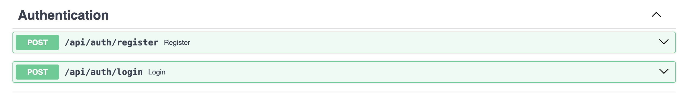

2) Users - эндпоинты связанные с пользователем 

<details>
  <summary>routers/users.py</summary>

```python
from sqlalchemy import select
from sqlalchemy.orm import selectinload
from connection import init_db, create_database, get_session
from security import hash_password, verify_password, create_access_token, get_current_user
from fastapi import FastAPI, HTTPException, Depends
from sqlmodel import Session, select, col
from fastapi import APIRouter

from models import *
from schemas import *


router = APIRouter()

@router.post("/")
def users_create(user: UserDefault,
                 session=Depends(get_session)) -> UserCreateResponse:
    user = User.model_validate(user)
    session.add(user)
    session.commit()
    session.refresh(user)
    return UserCreateResponse(status=200, data=user)


@router.get("/me")
def read_users_me(current_user: User = Depends(get_current_user)):
    return current_user


@router.get("/list")
def users_list(session=Depends(get_session)) -> List[UserFull]:
    return session.exec(select(User)).all()


@router.get("/{user_id}", response_model=UserFull)
def users_get(user_id: int, session=Depends(get_session)) -> User:
    return session.get(User, user_id)


@router.delete("/delete/{user_id}")
def users_delete(user_id: int, session=Depends(get_session)):
    user = session.get(User, user_id)
    if not user:
        raise HTTPException(status_code=404, detail="user not found")
    session.delete(user)
    session.commit()
    return {"ok": True}


@router.patch("/{user_id}")
def users_update(user_id: int,
                 user: UserDefault,
                 session=Depends(get_session)) -> UserDefault:
    db_user = session.get(User, user_id)
    if not db_user:
        raise HTTPException(status_code=404, detail="user not found")

    user_data = user.dict(exclude_unset=True)
    for key, value in user_data.items():
        setattr(user_data, key, value)
    session.add(db_user)
    session.commit()
    session.refresh(db_user)
    return db_user


@router.post("/{user_id}/skills", response_model=UserFull)
def add_skills_to_user(
        user_id: int,
        request: AddSkillsRequest,
        session: Session = Depends(get_session)
):
    statement = (
        select(User)
        .where(User.id == user_id)
        .options(selectinload(User.skills))
    )
    results = session.exec(statement)
    db_user = results.first()

    if not db_user:
        raise HTTPException(status_code=404, detail="user not found")
    skills_statement = select(Skill).where(col(Skill.id).in_(request.skill_ids))
    db_skills = session.exec(skills_statement).all()

    if not db_skills:
        raise HTTPException(status_code=404, detail="skills not found")
    for skill in db_skills:
        if skill not in db_user.skills:
            db_user.skills.append(skill)

    session.add(db_user)
    session.commit()
    session.refresh(db_user)

    return db_user


@router.post("/{user_id}/trips", response_model=UserFull)
def add_trips_to_user(
        user_id: int,
        request: AddTripRequest,
        session: Session = Depends(get_session)
):
    statement = (
        select(User)
        .where(User.id == user_id)
        .options(selectinload(User.trips))
    )
    results = session.exec(statement)
    db_user = results.first()

    if not db_user:
        raise HTTPException(status_code=404, detail="user not found")
    trips_statement = select(Trip).where(col(Trip.id).in_(request.trip_ids))
    db_trips = session.exec(trips_statement).all()

    if not db_trips:
        raise HTTPException(status_code=404, detail="trip not found")
    for trip in db_trips:
        if trip not in db_user.trips:
            db_user.trips.append(trip)

    session.add(db_user)
    session.commit()
    session.refresh(db_user)

    return db_user


@router.patch("/me/change-password")
def change_password(
    data: ChangePasswordRequest,
    session: Session = Depends(get_session),
    current_user: User = Depends(get_current_user)
):

    if not verify_password(data.old_password, current_user.hashed_password):
        raise HTTPException(
            status_code=status.HTTP_400_BAD_REQUEST,
            detail="Неверный текущий пароль"
        )
    
    if data.new_password != data.confirm_password:
        raise HTTPException(
            status_code=status.HTTP_400_BAD_REQUEST,
            detail="Новые пароли не совпадают"
        )

    if data.old_password == data.new_password:
        raise HTTPException(
            status_code=400,
            detail="Новый пароль не может совпадать со старым"
        )


    current_user.hashed_password = hash_password(data.new_password)
    session.add(current_user)
    session.commit()
    session.refresh(current_user)
    
    return {"message": "Пароль успешно изменен"}
```
</details>

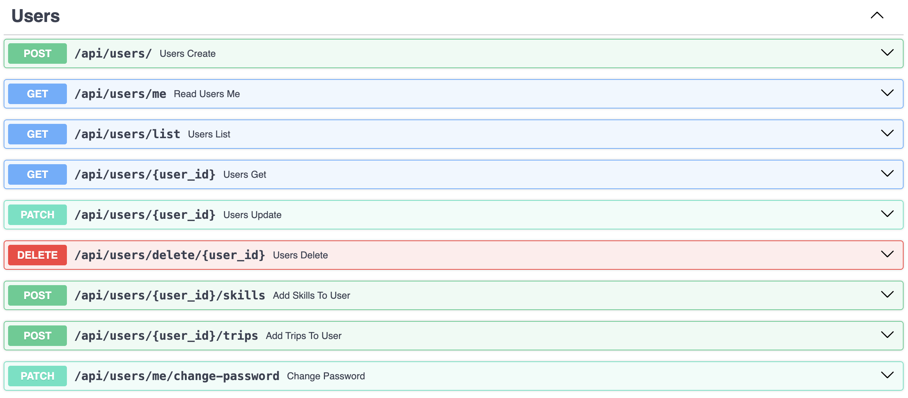


3) Skills

<details>
  <summary>routers/skills.py</summary>

```python 
from sqlalchemy import select
from connection import init_db, create_database, get_session
from fastapi import HTTPException, Depends
from sqlmodel import Session, select, col
from fastapi import APIRouter
from schemas import *
from models import *

router = APIRouter()


@router.get("/list")
def skills_list(session=Depends(get_session)) -> List[Skill]:
    return session.exec(select(Skill)).all()


@router.get("/{skill_id}")
def skill_get(skill_id: int,
              session=Depends(get_session)) -> Skill:
    return session.get(Skill, skill_id)


@router.post("/")
def skill_create(skill: SkillDefault,
                 session=Depends(get_session)) -> SkillCreateResponse:
    skill = Skill.model_validate(skill)
    session.add(skill)
    session.commit()
    session.refresh(skill)
    return SkillCreateResponse(status=201, data=skill)


@router.delete("/delete/{skill_id}")
def skill_delete(skill_id: int, session=Depends(get_session)):
    skill = session.get(Skill, skill_id)
    if not skill:
        raise HTTPException(status_code=404, detail="skill not found")
    session.delete(skill)
    session.commit()
    return {"ok": True}


@router.patch("/{skill_id}")
def skill_update(skill_id: int,
                 skill: Skill,
                 session=Depends(get_session)) -> Skill:
    db_skill = session.get(Skill, skill_id)
    if not db_skill:
        raise HTTPException(status_code=404, detail="skill not found")

    data = skill.dict(exclude_unset=True)
    for key, value in data.items():
        setattr(data, key, value)
    session.add(data)
    session.commit()
    session.refresh(db_skill)
    return db_skill

```
</details>


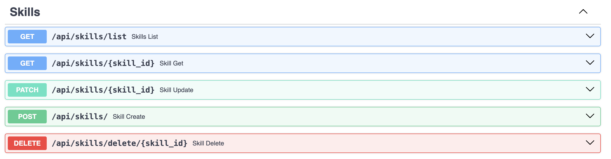


4) Trips - управление поездками 


<details>
  <summary>routers/trips.py</summary>

```python 
from sqlalchemy import select
from connection import get_session
from fastapi import HTTPException, Depends
from sqlmodel import Session, select
from fastapi import APIRouter, Query
from security import get_current_user
from schemas import *
from models import *

router = APIRouter()


@router.get("/list")
def trips_list(session=Depends(get_session)) -> List[Trip]:
    return session.exec(select(Trip)).all()


@router.get("/{trip_id}")
def trip_get(trip_id: int,
             session=Depends(get_session)) -> Trip:
    return session.get(Trip, trip_id)


@router.post("/")
def trip_create(trip_in: TripDefault,
                session=Depends(get_session),
                current_user: User = Depends(get_current_user)) -> TripCreateResponse:
    trip_data = trip_in.model_dump()
    trip_data["creator_id"] = current_user.id
    db_trip = Trip.model_validate(trip_data)
    session.add(db_trip)
    session.commit()
    session.refresh(db_trip)
    return TripCreateResponse(status=201, data=db_trip)


@router.delete("/delete/{trip_id}")
def trip_delete(trip_id: int,
                session=Depends(get_session),
                current_user: User = Depends(get_current_user)):
    trip = session.get(Trip, trip_id)
    if not trip:
        raise HTTPException(status_code=404, detail="trip not found")
    if trip.creator_id != current_user.id:
        raise HTTPException(status_code=403, detail="forbidden")
    session.delete(trip)
    session.commit()
    return {"ok": True}


@router.patch("/{trip_id}")
def trip_update(trip_id: int,
                session=Depends(get_session),
                current_user: User = Depends(get_current_user)) -> Trip:
    db_trip = session.get(Trip, trip_id)
    if not db_trip:
        raise HTTPException(status_code=404, detail="trip not found")
    if db_trip.creator_id != current_user.id:
        raise HTTPException(status_code=403, detail="forbidden")
    data = db_trip.dict(exclude_unset=True)
    for key, value in data.items():
        setattr(data, key, value)
    session.add(data)
    session.commit()
    session.refresh(db_trip)
    return db_trip


@router.get("/search", response_model=List[Trip])
def search_trips(departure: Optional[str] = Query(None),
                 arrival: Optional[str] = Query(None),
                 start_date: Optional[datetime.date] = Query(None),
                 end_date: Optional[datetime.date] = Query(None),
                 db: Session = Depends(get_session)) -> List[Trip]:
    statement = select(Trip)
    if departure:
        statement = statement.where(Trip.departure_place == departure)
    if arrival:
        statement = statement.where(Trip.arrival_place == arrival)
    if start_date:
        statement = statement.where(Trip.start_date == start_date)
    if end_date:
        statement = statement.where(Trip.end_date == end_date)

    results = db.exec(statement).all()
    return results


@router.delete("/{trip_id}/leave")
def leave_trip(
        trip_id: int,
        db: Session = Depends(get_session),
        current_user: User = Depends(get_current_user)
):
    statement = select(TripUserLink).where(
        TripUserLink.trip_id == trip_id,
        TripUserLink.user_id == current_user.id
    )
    link = db.exec(statement).first()

    if not link:
        raise HTTPException(status_code=404, detail="Вы не являетесь участником этой поездки")

    db.delete(link)
    db.commit()

    return {"message": "Вы успешно покинули поездку"}
```

</details>

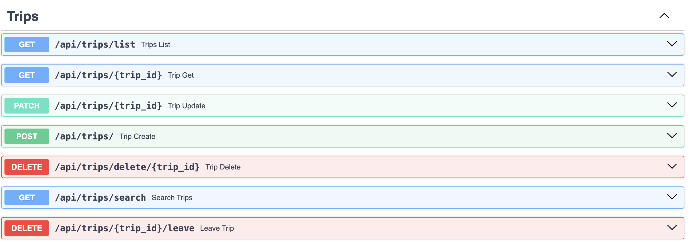

5) Professions


<details>
  <summary>routers/professions.py</summary>

```python 
from sqlalchemy import select
from connection import get_session
from fastapi import HTTPException, Depends, APIRouter
from sqlmodel import Session, select, col
from schemas import *
from models import *

router = APIRouter()

@router.get("/list")
def profession_list(session=Depends(get_session)) -> List[Profession]:
    return session.exec(select(Profession)).all()


@router.get("/{profession_id}")
def professions_get(profession_id: int,
                    session=Depends(get_session)) -> Profession:
    return session.get(Profession, profession_id)


@router.post("/")
def profession_create(prof: ProfessionDefault,
                      session=Depends(get_session)) -> ProfessionCreateResponse:
    prof = Profession.model_validate(prof)
    session.add(prof)
    session.commit()
    session.refresh(prof)
    return ProfessionCreateResponse(status=201, data=prof)


@router.delete("/delete/{profession_id}")
def professions_delete(profession_id: int, session=Depends(get_session)):
    profession = session.get(Profession, profession_id)
    if not profession:
        raise HTTPException(status_code=404, detail="profession not found")
    session.delete(profession)
    session.commit()
    return {"ok": True}


@router.patch("/{profession_id}")
def professions_update(profession_id: int,
                       profession: Profession,
                       session=Depends(get_session)) -> Profession:
    db_profession = session.get(Profession, profession_id)
    if not db_profession:
        raise HTTPException(status_code=404, detail="profession not found")

    profession_data = profession.dict(exclude_unset=True)
    for key, value in profession_data.items():
        setattr(profession_data, key, value)
    session.add(profession_data)
    session.commit()
    session.refresh(db_profession)
    return db_profession

```

</details>

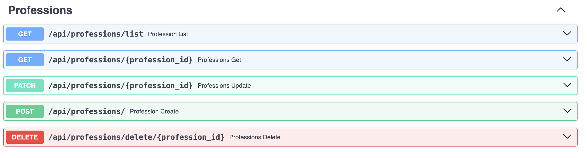


## Соединение с БД 

Соединение происходит через файл `connection.py`. Также там создается БД, если ее не существует. 

<details>
  <summary>connection.py</summary>

```python 
from sqlmodel import SQLModel, Session, create_engine
import psycopg2
from psycopg2.extensions import ISOLATION_LEVEL_AUTOCOMMIT
import os
from dotenv import load_dotenv

load_dotenv()
DB_USER = os.getenv("DB_USER", "postgres")
DB_PASS = os.getenv("DB_PASS","db")
DB_HOST = os.getenv("DB_HOST", "localhost")
DB_NAME = os.getenv("DB_NAME", "trips")

db_url = f'postgresql+psycopg2://{DB_USER}:{DB_PASS}@{DB_HOST}/{DB_NAME}'
engine = create_engine(db_url)

def create_database():
    conn = psycopg2.connect(
        dbname='postgres',
        user=DB_USER,
        password=DB_PASS,
        host=DB_HOST
    )
    conn.set_isolation_level(ISOLATION_LEVEL_AUTOCOMMIT)
    cursor = conn.cursor()

    try:
        cursor.execute(f"CREATE DATABASE {DB_NAME}")
        print(f"База данных {DB_NAME} успешно создана!")
    except psycopg2.errors.DuplicateDatabase:
        print(f"База данных {DB_NAME} уже существует.")
    finally:
        cursor.close()
        conn.close()

def init_db():
    SQLModel.metadata.create_all(engine)

def get_session():
    with Session(engine) as session:
        yield session
```

</details>

---
## Аутентификацию по JWT-токену

Реализованна в файле `security.py`
<details>
  <summary>security.py</summary>

```python
from fastapi import Request, Depends, HTTPException, status
from jose import JWTError, jwt
from passlib.context import CryptContext
from sqlmodel import Session, select
import os
from connection import get_session
from models import *


SECRET_KEY = os.getenv("SECRET_KEY", "key")
ALGORITHM = "HS256"
ACCESS_TOKEN_EXPIRE_MINUTES = 30

pwd_context = CryptContext(schemes=["bcrypt"], deprecated="auto")


def hash_password(password: str):
    return pwd_context.hash(password)


def verify_password(plain_password, hashed_password):
    return pwd_context.verify(plain_password, hashed_password)


def create_access_token(data: dict):
    to_encode = data.copy()
    expire = datetime.datetime.utcnow() + datetime.timedelta(minutes=ACCESS_TOKEN_EXPIRE_MINUTES)
    to_encode.update({"exp": expire})
    return jwt.encode(to_encode, SECRET_KEY, algorithm=ALGORITHM)


async def get_current_user(request: Request, db: Session = Depends(get_session)):

    auth_header = request.headers.get("Authorization")

    if not auth_header:
        raise HTTPException(
            status_code=status.HTTP_401_UNAUTHORIZED,
            detail="Missing Authorization Header"
        )

    try:
        scheme, token = auth_header.split()
        if scheme.lower() != "bearer":
            raise ValueError("Invalid scheme")

        payload = jwt.decode(token, SECRET_KEY, algorithms=[ALGORITHM])
        username: str = payload.get("sub")
        if username is None:
            raise HTTPException(status_code=401, detail="Invalid token")

    except (ValueError, JWTError):
        raise HTTPException(
            status_code=status.HTTP_401_UNAUTHORIZED,
            detail="Could not validate credentials",
        )

    statement = select(User).where(User.username == username)
    user = db.exec(statement).first()

    if user is None:
        raise HTTPException(status_code=401, detail="User not found")

    return user

```

</details>

--- 
## Работа приложения

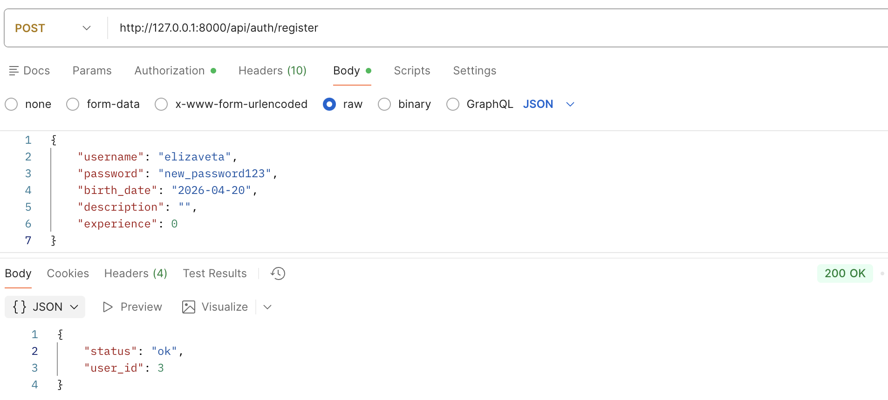
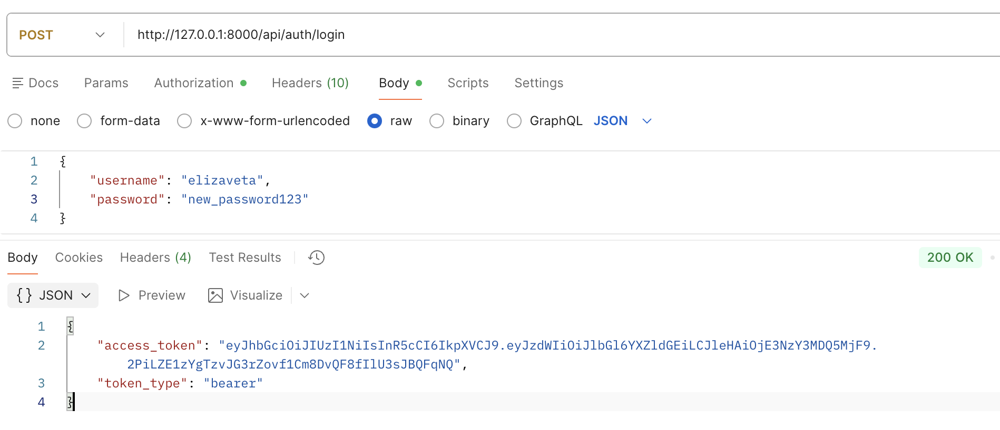
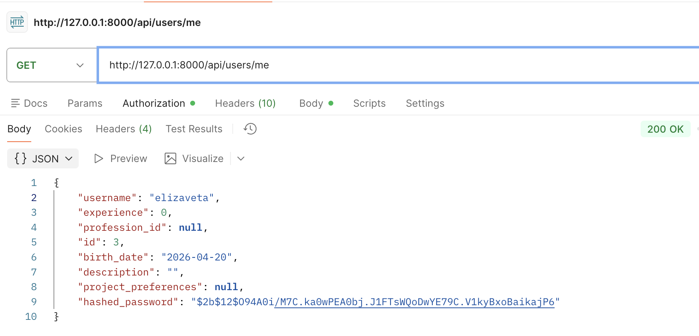
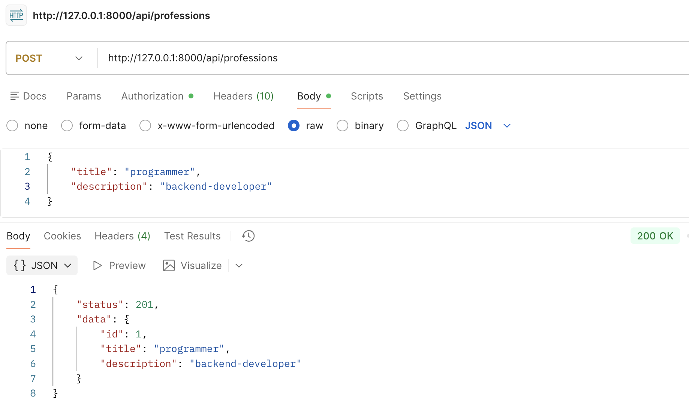
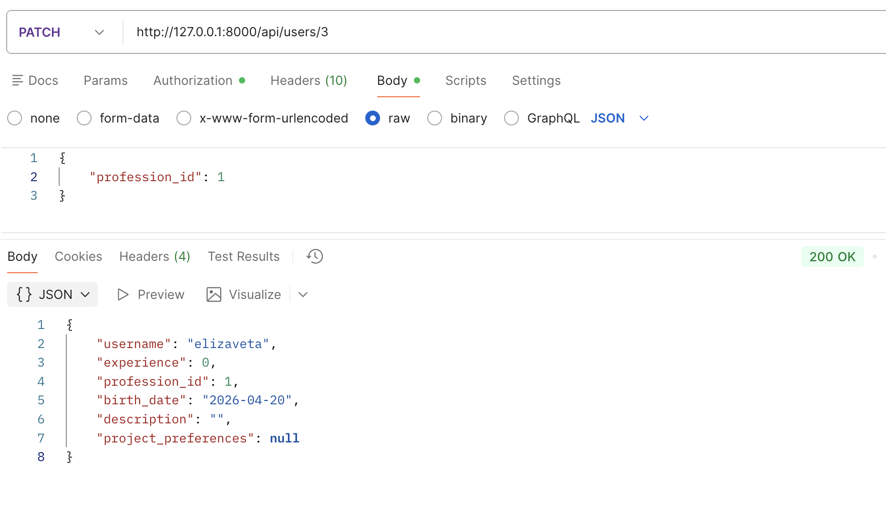
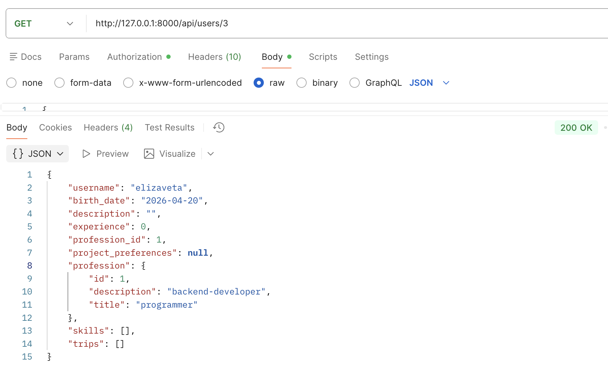
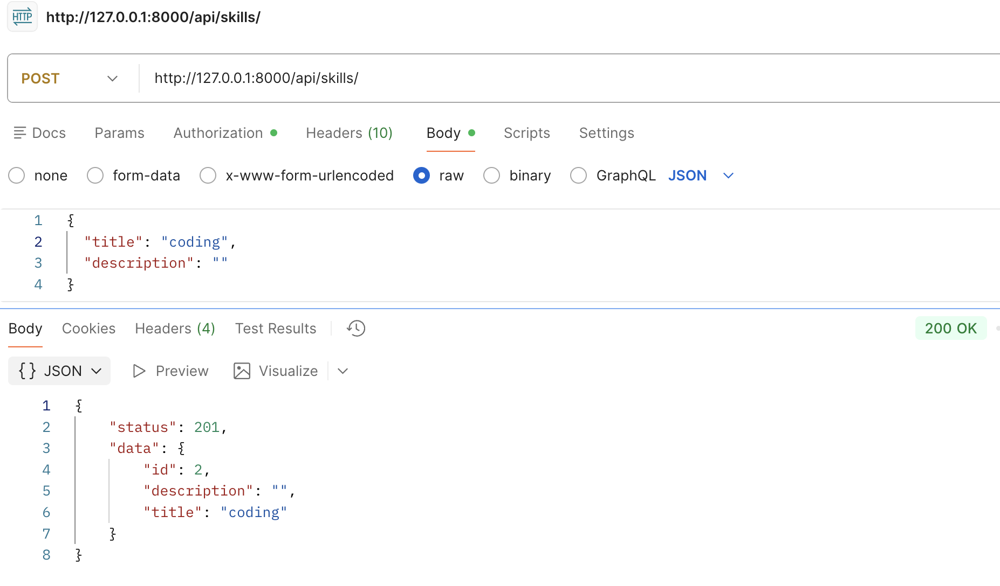
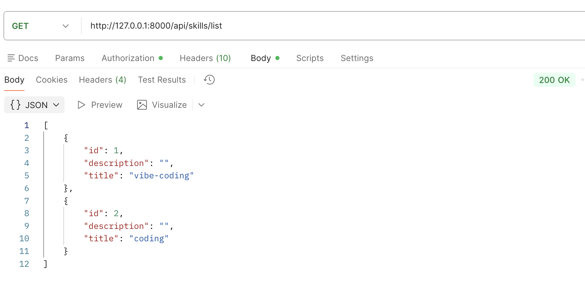
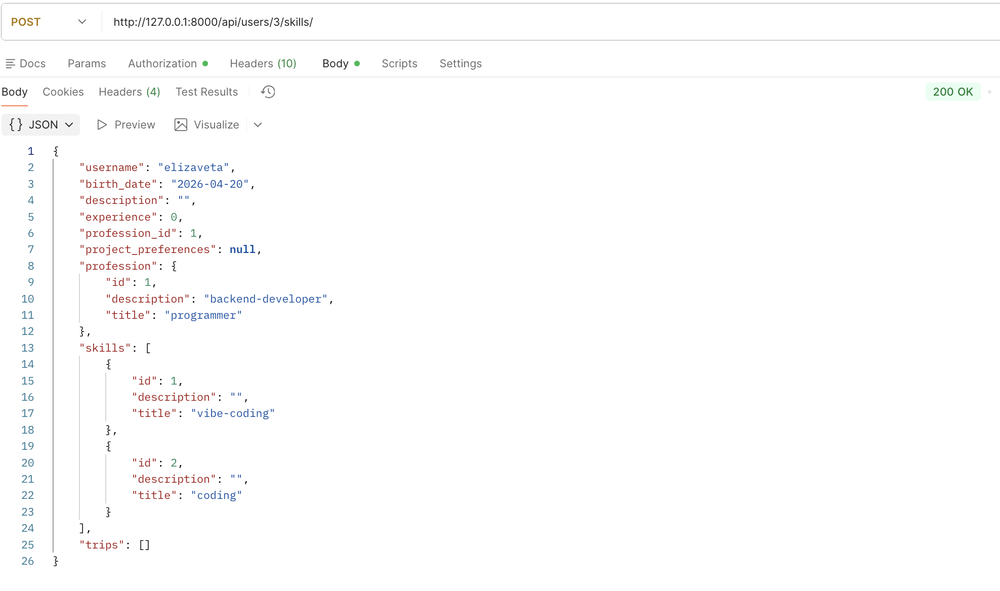
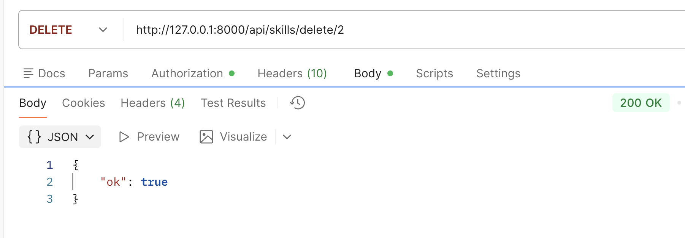
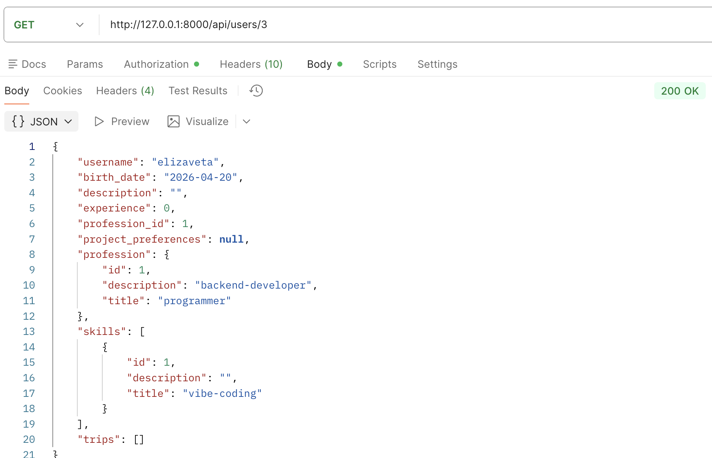
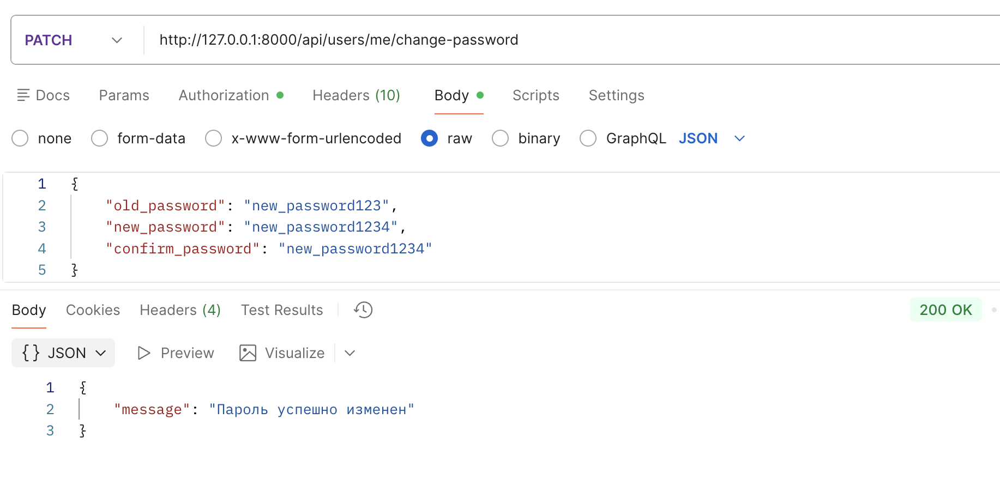
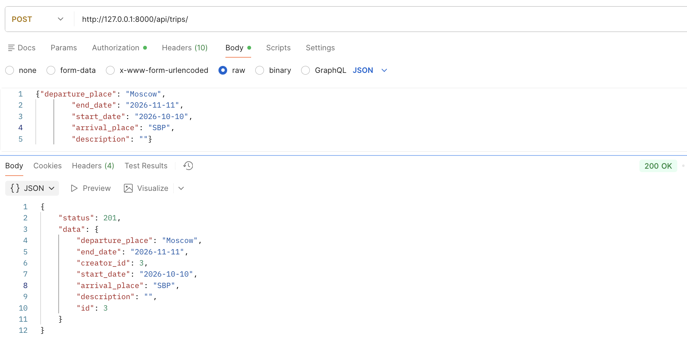
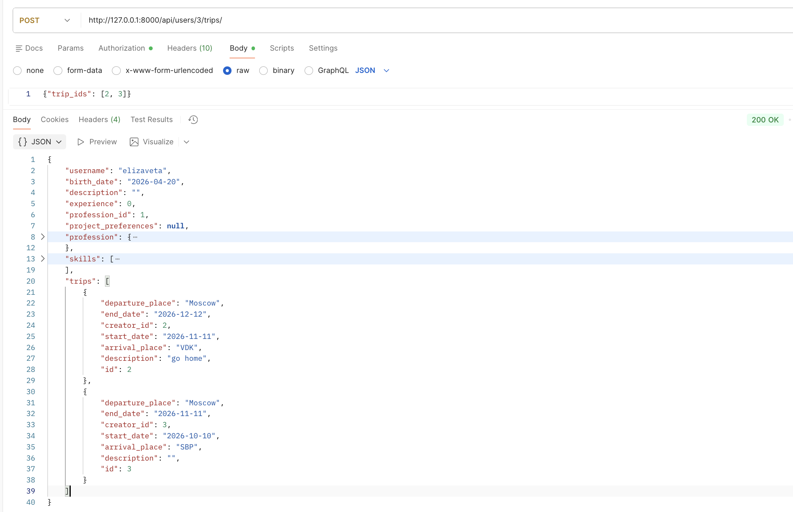
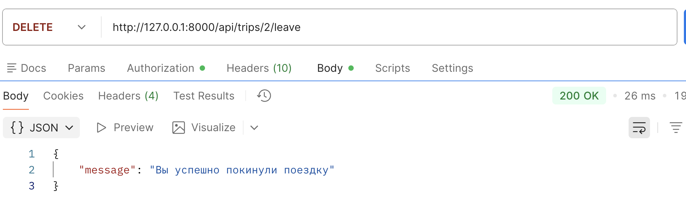