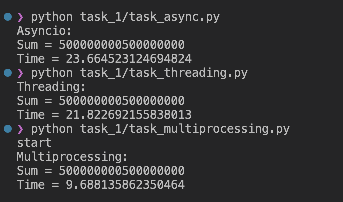
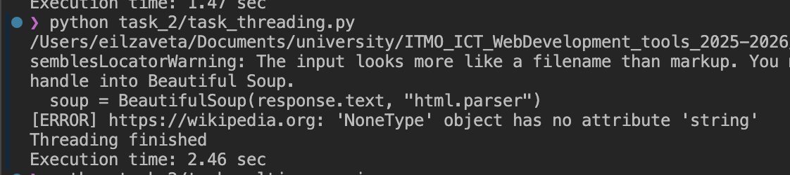
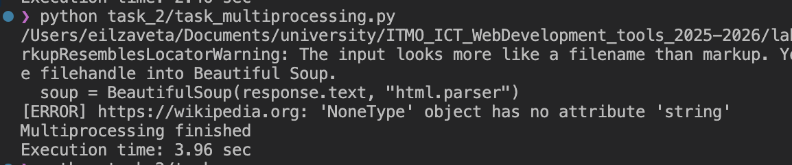
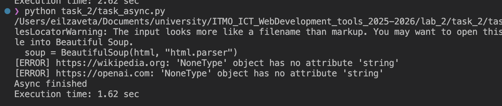

# Лабораторная работа 2. Потоки. Процессы. Асинхронность.

**Цель работы:** понять отличия потоками и процессами и понять, что такое ассинхронность в Python.

## Задание 1. Различия между threading, multiprocessing и async в Python

**Задача:** Напишите три различных программы на Python, использующие каждый из подходов: threading, multiprocessing и async. Каждая программа должна решать считать сумму всех чисел от 1 до 10000000000000. Разделите вычисления на несколько параллельных задач для ускорения выполнения.

<details>
  <summary>threading</summary>

```python
import threading
import time

N = 1000000000
# N = 10000000000000
NUM_THREADS = 4

results = [0] * NUM_THREADS


def calculate_sum(start, end, index):
    local_sum = 0

    for i in range(start, end + 1):
        local_sum += i

    results[index] = local_sum


if __name__ == "__main__":
    chunk_size = N // NUM_THREADS
    threads = []
    start_time = time.time()

    for i in range(NUM_THREADS):
        start_num = i * chunk_size + 1

        if i == NUM_THREADS - 1:
            end_num = N
        else:
            end_num = (i + 1) * chunk_size

        thread = threading.Thread(
            target=calculate_sum,
            args=(start_num, end_num, i)
        )

        threads.append(thread)
        thread.start()

    for thread in threads:
        thread.join()

    total_sum = sum(results)

    end_time = time.time()

    print("Threading:")
    print("Sum =", total_sum)
    print("Time =", end_time - start_time)
```

</details>

<details>
  <summary>multiprocessing</summary>

```python 
import multiprocessing
import time

N = 1_000_000_000
# N = 10000000000000
NUM_PROCESSES = 4


def calculate_sum(start, end):
    local_sum = 0

    for i in range(start, end + 1):
        local_sum += i

    return local_sum


if __name__ == "__main__":

    chunk_size = N // NUM_PROCESSES
    tasks = []

    for i in range(NUM_PROCESSES):

        start_num = i * chunk_size + 1

        if i == NUM_PROCESSES - 1:
            end_num = N
        else:
            end_num = (i + 1) * chunk_size

        tasks.append((start_num, end_num))
    print('start')

    start_time = time.time()

    with multiprocessing.Pool(NUM_PROCESSES) as pool:
        results = pool.starmap(calculate_sum, tasks)

    total_sum = sum(results)

    end_time = time.time()

    print("Multiprocessing:")
    print("Sum =", total_sum)
    print("Time =", end_time - start_time)

```

</details>

<details>
  <summary>async</summary>

```python 
import asyncio
import time

N = 1_000_000_000
# N = 10000000000000
NUM_TASKS = 4


async def calculate_sum(start, end):
    local_sum = 0
    for i in range(start, end + 1):
        local_sum += i
    return local_sum    


async def main():

    chunk_size = N // NUM_TASKS
    tasks = []

    for i in range(NUM_TASKS):

        start_num = i * chunk_size + 1

        if i == NUM_TASKS - 1:
            end_num = N
        else:
            end_num = (i + 1) * chunk_size

        tasks.append(
            asyncio.create_task(
                calculate_sum(start_num, end_num)
            )
        )

    results = await asyncio.gather(*tasks)

    return sum(results)


start_time = time.time()

total_sum = asyncio.run(main())

end_time = time.time()

print("Asyncio:")
print("Sum =", total_sum)
print("Time =", end_time - start_time)
```

</details>


### Результаты выполнения: 



<table>
  <tr>
    <th>Подход</th>
    <th>Время</th>
  </tr>
  <tr>
    <td>threading</td>
    <td>21.82 сек</td>
  </tr>
  <tr>
    <td>multiprocessing</td>
    <td>9.69 сек</td>
  </tr>
  <tr>
    <td>asyncio</td>
    <td>23.66 сек</td>
  </tr>
</table>

Для CPU-bound задачи лучший результат показал multiprocessing (9.69 сек), поскольку он использует несколько независимых процессов и позволяет выполнять вычисления параллельно на разных ядрах процессора. threading оказался значительно медленнее (21.82 сек) из-за GIL, который не позволяет нескольким потокам одновременно выполнять Python bytecode в CPU-bound задачах. asyncio показал результат 23.66 сек, так как асинхронность эффективна для I/O-bound операций, а не для вычислений.


## Задание 2. Параллельный парсинг веб-страниц с сохранением в базу данных

**Задача:** Напишите программу на Python для параллельного парсинга нескольких веб-страниц с сохранением данных в базу данных с использованием подходов threading, multiprocessing и async. Каждая программа должна парсить информацию с нескольких веб-сайтов, сохранять их в базу данных.

Для парсинга использовались URLs:
<details>
    <summary>URLS</summary>

```python 
URLS = [
    "https://example.com",
    "https://python.org",
    "https://github.com",
    "https://stackoverflow.com",
    "https://wikipedia.org",
    "https://openai.com",
    "https://reddit.com",
    "https://news.ycombinator.com",
    "https://docs.python.org",
    "https://pypi.org",
    "https://fastapi.tiangolo.com",
    "https://sqlmodel.tiangolo.com",
    "https://realpython.com",
    "https://www.bbc.com",
    "https://www.cnn.com",
    "https://www.nytimes.com",
    "https://www.mozilla.org",
    "https://www.apple.com",
    "https://www.microsoft.com",
    "https://www.amazon.com",
]
```

</details>


Данные записываются в таблицу Skills:

```python 
class Skill(SQLModel, table=True):
    id: int = Field(default=None, primary_key=True)
    title: str
    description: Optional[str]
```

Подключение к БД для threading и multiprocessing:

```python 
DATABASE_URL = f"postgresql://{DB_USER}:{DB_PASS}@{DB_HOST}/{DB_NAME}"
engine = create_engine(DATABASE_URL)
```

Подключение к БД для async:

```python 
DATABASE_URL = f"postgresql+asyncpg://{DB_USER}:{DB_PASS}@{DB_HOST}/{DB_NAME}"
engine = create_async_engine(DATABASE_URL, echo=False)
AsyncSessionLocal = sessionmaker(engine, class_=AsyncSession, expire_on_commit=False)
```

<details>
  <summary>threading</summary>

```python 
def parse_and_save(url):
    try:
        response = requests.get(url, timeout=10)

        soup = BeautifulSoup(response.text, "html.parser")

        title = soup.title.string.strip()

        skill = Skill(
            title=title + ' [threading]',
            description=f"Parsed from {url}"
        )

        with Session(engine) as session:
            session.add(skill)
            session.commit()


    except Exception as e:
        print(f"[ERROR] {url}: {e}")


threads = []
start_time = time.time()


for url in URLS:
    thread = threading.Thread(target=parse_and_save, args=(url,))
    threads.append(thread)
    thread.start()

for thread in threads:
    thread.join()

```
</details>


<details>
  <summary>multiprocessing</summary>

```python 
def parse_and_save(url):
    try:
        response = requests.get(url, timeout=10)
        soup = BeautifulSoup(response.text, "html.parser")
        title = soup.title.string.strip()
        skill = Skill(
            title=title + ' [multiprocessing]',
            description=f"Parsed from {url}"
        )
        with Session(engine) as session:
            session.add(skill)
            session.commit()

    except Exception as e:
        print(f"[ERROR] {url}: {e}")


if __name__ == "__main__":
    start_time = time.time()

    with multiprocessing.Pool(4) as pool:
        pool.map(parse_and_save, URLS)

```
</details>

<details>
  <summary>async</summary>

```python 
async def parse_and_save(client, url):
    try:
        async with client.get(url) as response:
            html = await response.text()
        soup = BeautifulSoup(html, "html.parser")
        title = soup.title.string.strip()
        skill = Skill(
            title=title + " [async]",
            description=f"Parsed from {url}"
        )
        async with AsyncSessionLocal() as session:
            session.add(skill)
            await session.commit()


    except Exception as e:
        print(f"[ERROR] {url}: {e}")


async def main():
    async with aiohttp.ClientSession() as client:
        tasks = []
        for url in URLS:
            tasks.append(
                asyncio.create_task(
                    parse_and_save(client, url)
                )
            )
        await asyncio.gather(*tasks)


start_time = time.time()
asyncio.run(main())
end_time = time.time()

```
</details>

### Результаты выполнения: 




<table>
  <tr>
    <th>Подход</th>
    <th>Время</th>
  </tr>
  <tr>
    <td>threading</td>
    <td>2.46 сек</td>
  </tr>
  <tr>
    <td>multiprocessing</td>
    <td>3.96 сек</td>
  </tr>
  <tr>
    <td>asyncio</td>
    <td>1.62 сек</td>
  </tr>
</table>

1) asyncio - самый быстрый, потому что задача I/O-bound: ожидание HTTP-запросов и работы базы данных. Asyncio эффективно переключается между задачами без создания потоков и процессов.

2) threading — потоки хорошо подходят для сетевых операций, а во время I/O GIL не мешает работе

3) multiprocessing — самый медленный, потому что для I/O-bound задач создание отдельных процессов почти не приносит пользы.


