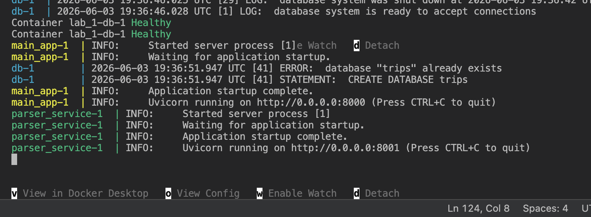
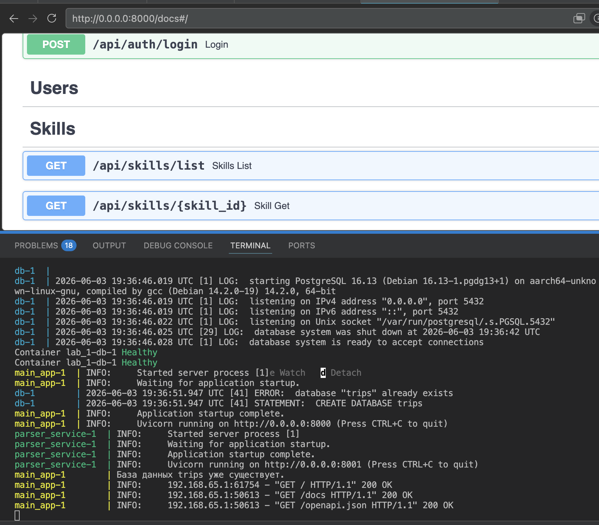
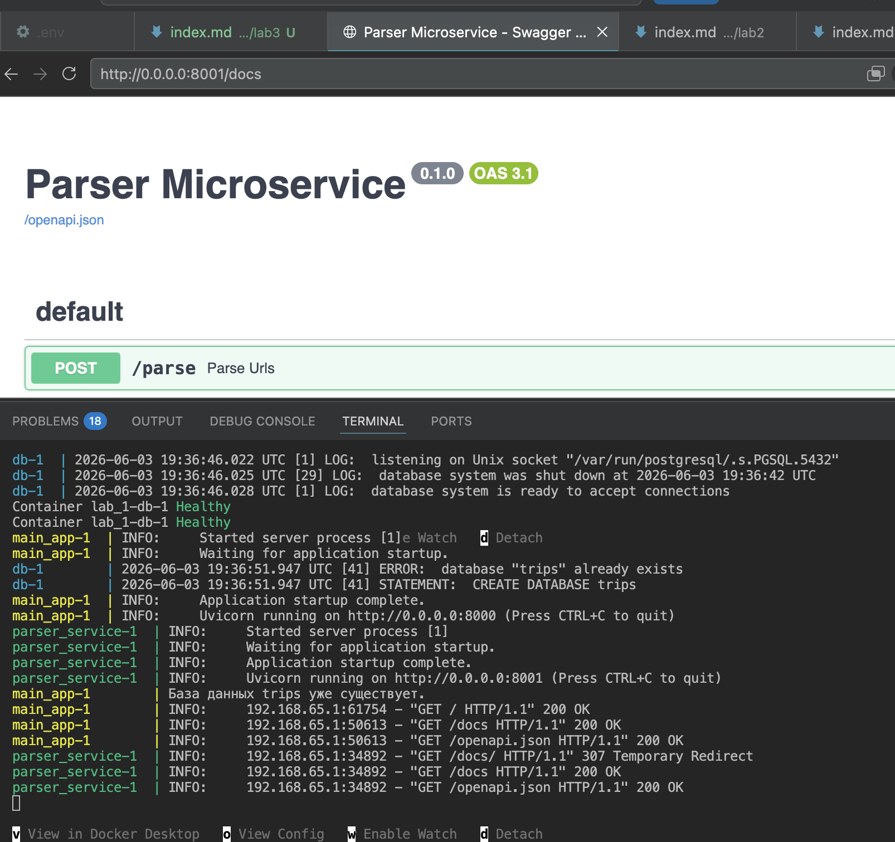
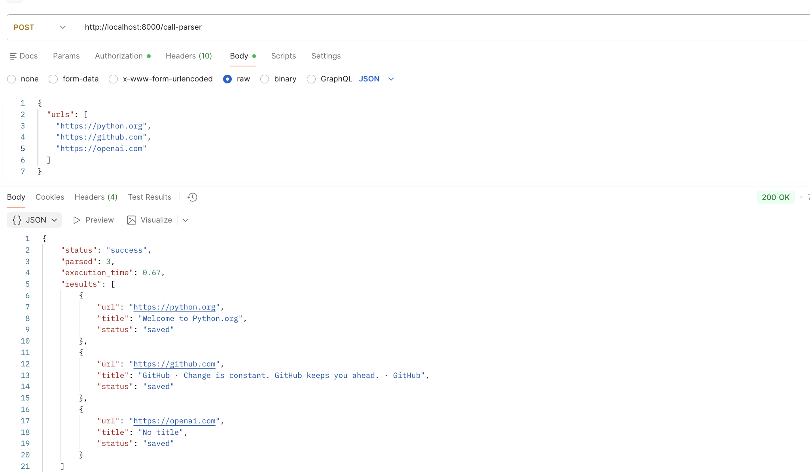
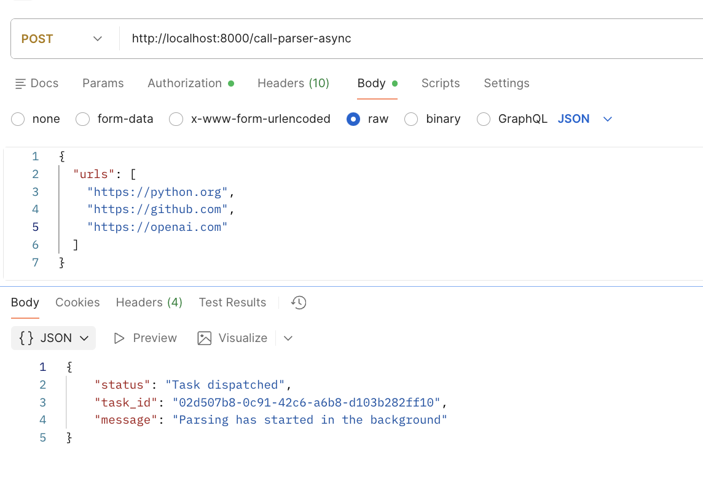
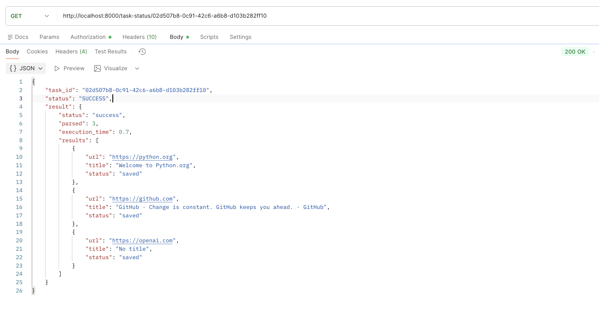
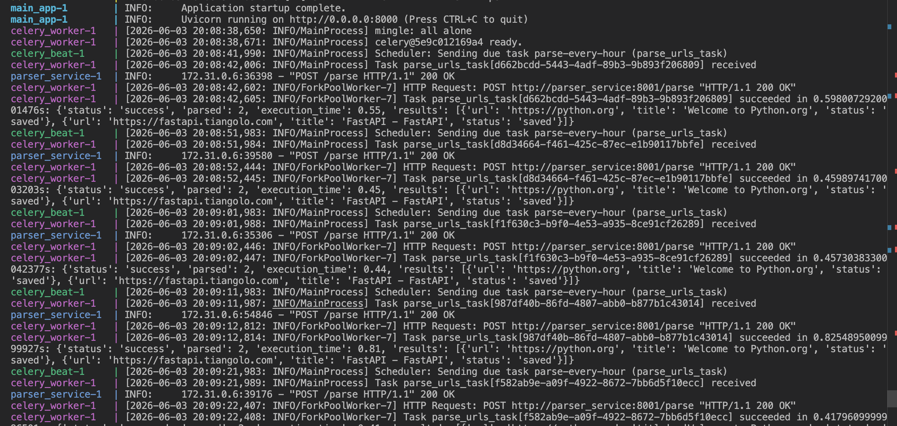

# Лабораторная работа 3. Упаковка FastAPI приложения в Docker, Работа с источниками данных и Очереди

**Цель работы:** Научиться упаковывать FastAPI приложение в Docker, интегрировать парсер данных с базой данных и вызывать парсер через API и очередь.

## Подзадача 1: Упаковка FastAPI приложения, базы данных и парсера данных в Docker


<details>
  <summary>parser_app.py</summary>
  
```python 
import asyncio
import time
import aiohttp
from bs4 import BeautifulSoup
from fastapi import FastAPI
from sqlmodel import SQLModel
from sqlalchemy.ext.asyncio import create_async_engine, AsyncSession
from sqlalchemy.orm import sessionmaker
from models import Skill
from schemas import ParseRequest
from dotenv import load_dotenv
import os


load_dotenv()
DB_USER = os.getenv('DB_USER')
DB_PASS = os.getenv('DB_PASS')
DB_HOST = os.getenv('DB_HOST')
DB_NAME = os.getenv('DB_NAME')

DATABASE_URL = (
    f"postgresql+asyncpg://{DB_USER}:{DB_PASS}"
    f"@{DB_HOST}:5432/{DB_NAME}"
)


engine = create_async_engine(DATABASE_URL)

AsyncSessionLocal = sessionmaker(
    engine,
    class_=AsyncSession,
    expire_on_commit=False
)

app = FastAPI(title="Parser Microservice")

semaphore = asyncio.Semaphore(5)

async def parse_and_save(client, url: str):
    async with semaphore:
        try:
            async with client.get(url) as response:
                html = await response.text()

            soup = BeautifulSoup(html, "html.parser")
            title = soup.title.string.strip() if soup.title else "No title"
            skill = Skill(
                title=title + " [async]",
                description=f"Parsed from {url}"
            )

            async with AsyncSessionLocal() as session:
                session.add(skill)
                await session.commit()

            return { "url": url, "title": title, "status": "saved"}

        except Exception as e:
            return {"url": url, "status": "error", "error": str(e)}


@app.post("/parse")
async def parse_urls(data: ParseRequest):
    start_time = time.time()
    timeout = aiohttp.ClientTimeout(total=10)

    async with aiohttp.ClientSession(timeout=timeout) as client:
        tasks = [asyncio.create_task(parse_and_save(client, url)) for url in data.urls]
        results = await asyncio.gather(*tasks)
    execution_time = round(time.time() - start_time, 2)
    return {
        "status": "success",
        "parsed": len(results),
        "execution_time": execution_time,
        "results": results
        }


@app.on_event("startup")
async def on_startup():
    pass
```

</details>


<details>
  <summary>Dockerfile</summary>

```Dockerfile 
FROM python:3.12-slim

WORKDIR /app

RUN apt-get update && apt-get install -y --no-install-recommends \
    build-essential \
    && rm -rf /var/lib/apt/lists/*

COPY requirements.txt .
RUN pip install --no-cache-dir -r requirements.txt

COPY . .
```

</details>


<details>
  <summary>docker-compose.yml</summary>

```yaml
version: '3.9'

services:
  # Сервис базы данных
  db:
    image: postgres:16
    restart: always
    environment:
      POSTGRES_USER: ${DB_USER}
      POSTGRES_PASSWORD: ${DB_PASS}
      POSTGRES_DB: ${DB_NAME}
    ports:
      - "5432:5432"
    volumes:
      - postgres_data:/var/lib/postgresql/data
    env_file:
      - .env
    healthcheck:
      test: ["CMD-SHELL", "pg_isready -U ${DB_USER} -d ${DB_NAME}"]
      interval: 5s
      timeout: 5s
      retries: 5


  main_app:
    build: .
    restart: always
    command: uvicorn main:app --host 0.0.0.0 --port 8000
    ports:
      - "8000:8000"
    env_file:
      - .env
    depends_on:
      db:
        condition: service_healthy

  parser_service:
    build: .
    restart: always
    command: uvicorn parser_app:app --host 0.0.0.0 --port 8001
    ports:
      - "8001:8001"
    env_file:
      - .env
    depends_on:
      db:
        condition: service_healthy

volumes:
  postgres_data:
```

</details>

Докер успешно запущен, оба сервиса работают:





## Подзадача 2: Вызов парсера из FastAPI

Создадим эндпоинт для вызова парсера в основном приложении `main.py`

```python
@app.post("/call-parser")
async def call_parser_endpoint(data: ParseRequest):
    """
    Эндпоинт, который принимает список URL и пересылает их микросервису-парсеру
    """
    async with httpx.AsyncClient() as client:
        try:
            response = await client.post(
                PARSER_SERVICE_URL,
                json={"urls": data.urls},
                timeout=10.0
            )
            
            response.raise_for_status()
            
            return response.json()
            
        except httpx.ConnectError:
            raise HTTPException(status_code=503, detail="Parser service is unavailable")
        except httpx.HTTPStatusError as e:
            raise HTTPException(status_code=e.response.status_code, detail=e.response.text)
        except Exception as e:
            raise HTTPException(status_code=500, detail=str(e))
```


Вызов парсера из основного приложения: 



## Подзадача 3: Celery и Redis


<details>
  <summary>celery_app.py</summary>

```python 
import os
import time
import asyncio
from celery import Celery
import httpx


REDIS_URL = os.getenv("REDIS_URL", "redis://redis:6379/0")

celery_app = Celery(
    "worker",
    broker=REDIS_URL,
    backend=REDIS_URL
)


celery_app.conf.task_serializer = 'json'
celery_app.conf.result_serializer = 'json'
celery_app.conf.accept_content = ['json']
celery_app.conf.result_expires = 3600 

@celery_app.task(name="parse_urls_task")
def parse_urls_task(urls: list):
    PARSER_URL = "http://parser_service:8001/parse"
    
    with httpx.Client(timeout=60.0) as client:
        response = client.post(PARSER_URL, json={"urls": urls})
        return response.json()

```

</details>


В `main.py` добавлены два новых эндпоинта: первый ставит задачу в очередь и сразу возвращает ID, второй показывает статус и результат по задаче 

<details>
  <summary>main.py</summary>

```python 
@app.post("/call-parser-async")
async def call_parser_async(data: ParseRequest):
    task = parse_urls_task.delay(data.urls)
    
    return {
        "status": "Task dispatched",
        "task_id": task.id,
        "message": "Parsing has started in the background"
    }


@app.get("/task-status/{task_id}")
async def get_task_status(task_id: str):
    task_result = AsyncResult(task_id, app=celery_app)
    
    result = {
        "task_id": task_id,
        "status": task_result.status,
    }
    
    if task_result.status == 'SUCCESS':
        result["result"] = task_result.result # То, что вернула функция parse_urls_task
    elif task_result.status == 'FAILURE':
        result["error"] = str(task_result.info)
        
    return result

```

</details>

И обновим `docker-compose.yml`: добавим Redis и сам процесс воркера (Celery).





## Подзадача 4: Настройка переодических задач с Celery

Добавим расписание (beat schedule) в конфигурацию Celery. (`celery_app.py`)

```python 

celery_app.conf.beat_schedule = {
    'parse-every-hour': {
        'task': 'parse_urls_task', 
        'schedule': 3600.0, 
        'args': (['https://python.org', 'https://fastapi.tiangolo.com'],)
    },
}

celery_app.conf.timezone = 'UTC'
```

Для периодических задач нужно запустить отдельный процесс celery beat. Он не выполняет сами задачи, он только дает воркеру их начать.

```yaml 
celery_beat:
    build: .
    command: celery -A celery_app beat --loglevel=info
    depends_on:
      redis:
        condition: service_started
    env_file:
      - .env
```

